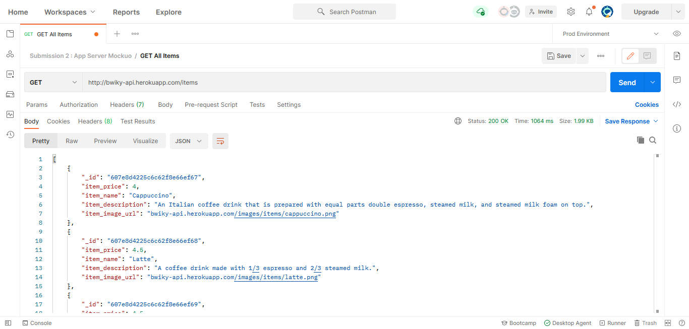
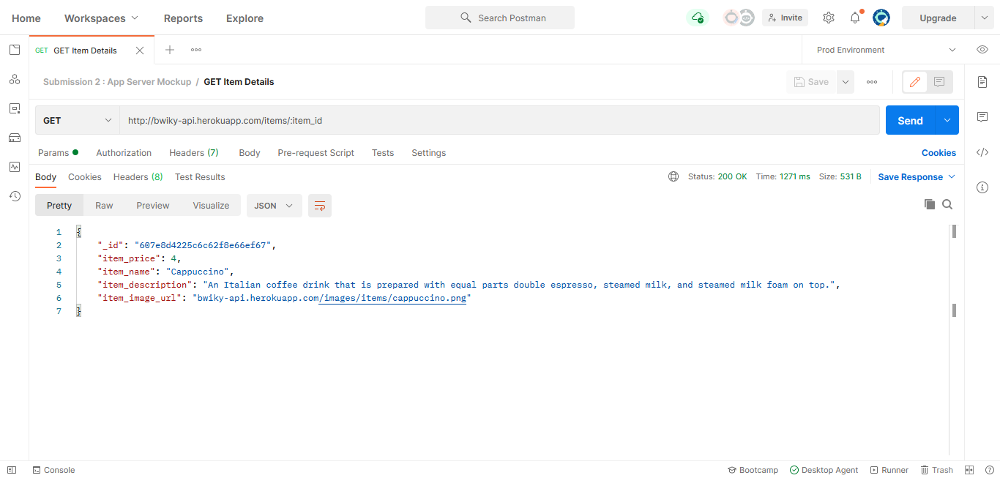
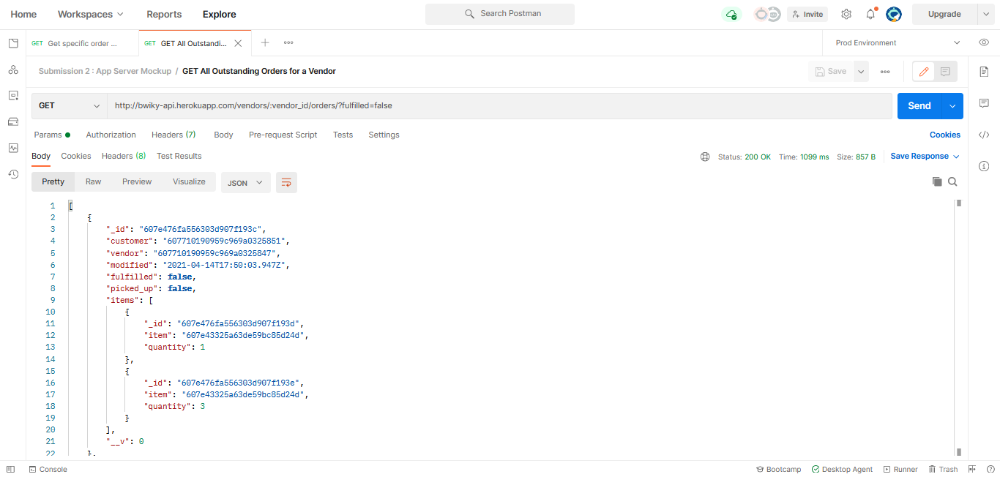

**The University of Melbourne**
# INFO30005 – Web Information Technologies

# Group Project Repository - BWIKY (T04)

## Table of contents
* [Team Members](#team-members)
* [General Information](#general-info)
* [Technologies](#technologies)
* [Submission 4: Completed Web Application](#submission-4)
    * [Heroku URLs](#urls)
    * [Vendor Login Details](#vendor-login)
    * [Customer Login Details](#cust-login)
    * [Testing](#testing)
* [Submission 3: Backend with Frontend](#submission-3)
* [Submission 2: App Server Mockup](#submission-2)


## Team Members
| Name | Task |
| :---         |     :---:      |
| Ivy Brain  | Fullstack     |
| Wen Yee Ang   | Fullstack    |
| Benjamin Cook   | Fullstack    |
| Yee Kay Lee    | Front End, UI |
| Yu Tong Gan   | Front End, UI |


<a name="general-info"></a>
## General Information
Web Information Technologies Web App Project by Team BWIKY.
The customer client is located at /customer, and the vendor client is located at /vendor.

### Important Notes About This Project:
* Please ensure that you use https to access the website.
* Please ensure that you enable "Allow Location" on both the customer client and vendor client.


<a name="technologies"></a>
## Technologies
Project is created with:
* NodeJs version: 14.16.0
* Express version: 4.17.1
* Mongoose version: 5.12.3


<a name="submission-4"></a>
## Submission 4: Completed Web Application

<a name="urls"></a>
### Heroku URLs:
#### Live Website for Customer Client:
https://bwiky.herokuapp.com/customer/

#### Live Website for Vendor Client:
https://bwiky.herokuapp.com/vendor/


<a name="vendor-login"></a>
### Login Details (Vendors):
Example Vendor 1:
* Van Name: Van Damme
* Password: password

Example Vendor 2:
* Van Name: The Snack AdVANtage
* Password: password

Example Vendor 3:
* Van Name: VANish your hunger
* Password: password


<a name="cust-login"></a>
### Login Details (Customers):
Example Customer 1:
* Email Address: littleprincess@empire.gb
* Password: testsara

Example Customer 2:
* Email Address: editor@rodentsgazette.ms
* Password: testgeronimo

Example Customer 3:
* Email Address: william@playwright.uk
* Password: testwilliam

Note that you can also create an account yourself to log in.


<a name="submission-3"></a>
## Submission 3: Backend with Frontend

### Features:
**1. Customer Login**

Click on the "LOG IN" button on the Navigation Bar to log in.
<p align="center">
  
</p>

Enter the sample customer login details.
<p align="center">
  
</p>

If the user did not log in, they will still be allowed to click on a van and order snacks. However, when the user tries to confirm their order, they will be redirected to the log in page (their current order is saved locally).

**2. View menu of snacks (including pictures and prices)**

Scroll down on the main page and click on any of the vans to access its menu (all vendors have the same menu).
<p align="center">
  
</p>
<p align="center">
  
</p>

**3. Order three different snacks**

Click on "ADD TO ORDER" under the desired snack to add it to a 'shopping cart'.
<p align="center">
  
</p>

After clicking on three different snacks, the customer will be prompted to review their order or continue shopping.
<p align="center">
  
</p>

The customer can then confirm their order. If the customer was not logged in, they will be redirected to the log in page.
The order is persisted in the database.
<p align="center">
  
</p>

**4. View Order Details**

After clicking on "CONFIRM ORDER", the customer will be redirected to the "My Orders" page, where they can view the details and status of their current and previous orders.
<p align="center">
  
</p>


<a name="submission-2"></a>
## Submission 2: App Server Mockup

### Heroku URL (API) :
https://bwiky-api.herokuapp.com/

### API Testing with Postman :

The description on how to test our implemented routes is below, with examples and sample outputs. We have split the routes into three collections: Items, Orders and Vendors.

#### Routes for Customer Features :
**1. View menu of all snacks (including pictures and prices)**
  * **Type :** GET
  * **Heroku Address :**  http://bwiky-api.herokuapp.com/items
  * **Sample Output :**
<p align="center">
  
</p>
  Note: Images of snacks are hosted on the server at /images/items/<name>.png.


**2. View details of a snack**
  * **Type :** GET
  * **Heroku Address :**  http://bwiky-api.herokuapp.com/items/:item_id
  * **Example Address :** http://bwiky-api.herokuapp.com/items/607e8d4225c6c62f8e66ef67
  * **Sample Output :**
<p align="center">
  
</p>


**3. Create a new order (by requesting first snack)**
  * **Type :** POST
  * **Heroku Address :**  http://bwiky-api.herokuapp.com/vendors/:vendor_id/orders
  * **Example Address :** http://bwiky-api.herokuapp.com/vendors/607710190959c969a0325846/orders
  * **Example Input (body) :**
  ```HTML
  Format:
  {
    "customer": <<customer_id>>,
    "fulfilled": false,
    "picked_up": false,
    "items": [
        {
              "item": <<item_id>>,
              "quantity": <<Num>>
        }
    ]
  }

 Example:
  {
    "customer": "60770c600959c969a0325836",
    "fulfilled": false,
    "picked_up": false,
    "items": [
        {
            "item": "607e8d4225c6c62f8e66ef67",
            "quantity": 3
        }
    ]
  }
```
  * **Sample Output** :
<p align="center">
  
</p>


#### Vendor Features:
**1. Set van status (vendor sends location, marks van as ready-for-orders)**
   * **Type :** PATCH
   * **Heroku Address :**  http://bwiky-api.herokuapp.com/vendors/:vendor_id
   * **Example Address :** http://bwiky-api.herokuapp.com/vendors/607710190959c969a0325846
   * **Example Input (body) :**
  ```HTML
  Format (JSON includes the location of the van as latitude and longitude):
    {
      "location": {
        "lat": <<Num>>,
        "long": <<Num>>
      },
      "ready": <<Boolean>>
    }

  Example:
    {
      "location": {
        "lat": "77",
        "long": "20"
      },
      "ready": "true"
    }
  ```
   * **Sample Output :**
<p align="center">
  
</p>


**2. Show list of all outstanding orders**
   * **Type :** GET
   * **Heroku Address :**  http://bwiky-api.herokuapp.com/vendors/:vendor_id/orders/?fulfilled=false
   * **Example Address :** http://bwiky-api.herokuapp.com/vendors/607710190959c969a0325847/orders/?fulfilled=false
   * **Sample Output :**
<p align="center">
  
</p>


**3. Mark an order as "fulfilled" (ready to be picked up by customer)**
   * **Type :** PATCH
   * **Heroku Address :**  http://bwiky-api.herokuapp.com/vendor/:vendorid/orders/:orderid
   * **Example Address :** http://bwiky-api.herokuapp.com/vendors/607710190959c969a0325847/orders/60816d78eac7d30015cce88c
   * **Example Input (body) :**
 ```HTML
    {
    "fulfilled": true
    }
 ```
   * **Sample Output :**
<p align="center">
  
</p>
